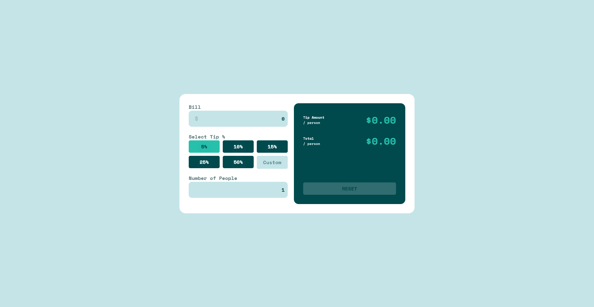
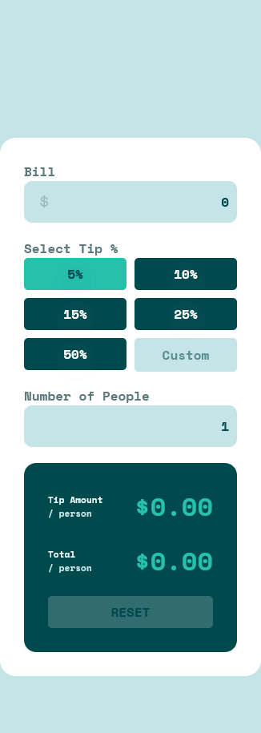

# Frontend Mentor - Tip calculator app solution

This is a solution to the [Tip calculator app challenge on Frontend Mentor](https://www.frontendmentor.io/challenges/tip-calculator-app-ugJNGbJUX). Frontend Mentor challenges help you improve your coding skills by building realistic projects.

## Table of contents

- [Overview](#overview)
  - [The challenge](#the-challenge)
  - [Screenshot](#screenshot)
  - [Links](#links)
- [My process](#my-process)
  - [Built with](#built-with)
  - [What I learned](#what-i-learned)
  - [Continued development](#continued-development)
  - [Useful resources](#useful-resources)
- [Author](#author)

**Note: Delete this note and update the table of contents based on what sections you keep.**

## Overview

### The challenge

Users should be able to:

- View the optimal layout for the app depending on their device's screen size
- See hover states for all interactive elements on the page
- Calculate the correct tip and total cost of the bill per person

### Screenshot

### Links

- Solution URL: [solution URL](https://github.com/imandreans/tip-calculator-app-main)
- Live Site URL: [live site](https://your-live-site-url.com)

## My process

### Built with

- Semantic HTML5 markup
- CSS custom properties
- Flexbox
- CSS Grid
- Javascript DOM

### What I learned

I learned more on implementing Javascript DOM. How each component react to others.

### Continued development

More on refactoring the javascript DOM.

### Useful resources

## Author

- Website - [Andrean](https://portfolio-gamma-three-44.vercel.app/)
- Frontend Mentor - [@imandreans](https://www.frontendmentor.io/profile/imandreans)
- Twitter - [@imandreans](https://www.twitter.com/imandreans)
